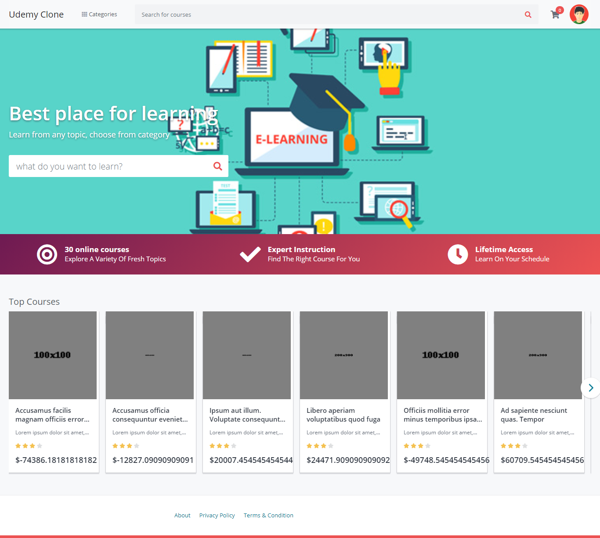
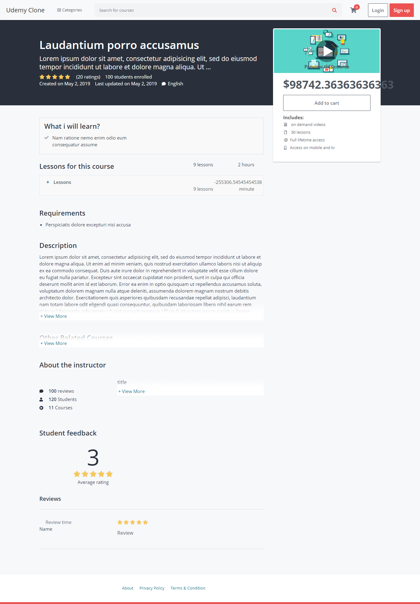
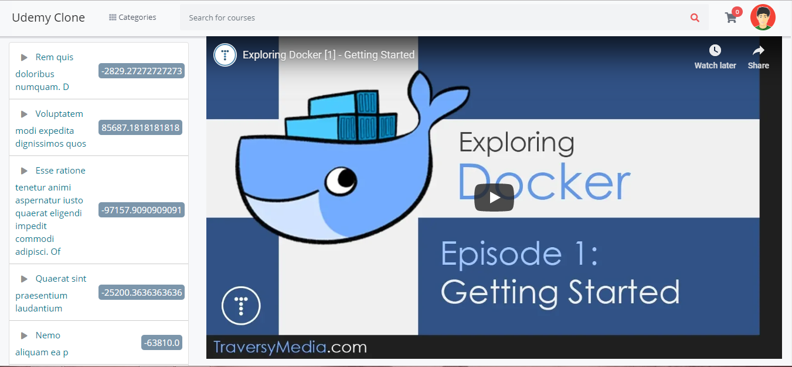

## Django E-Learning App

Live: [Demo](https://django-udemy-clone.herokuapp.com/)

Used Tech Stack

1. Django
2. Sqlite

### Screenshots

## Home page

## Course Details page

## Enrolled course details

Show your support by 🌟 the project!!